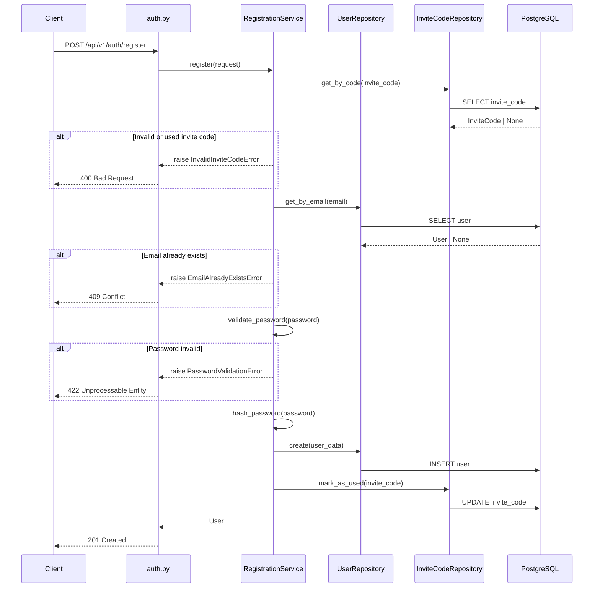

# Technical Design

## Metadata

| Field | Value |
|-------|-------|
| Feature ID | FEAT-001 |
| Feature Name | User Registration |
| Status | APPROVED |
| Author | Developer / AI-assisted |
| Reviewer | |
| Date | 2026-01-21 |

---

## Overview

This feature implements invite-only user registration using FastAPI's dependency injection pattern with a layered architecture (endpoint → service → repository). Users submit an invite code, email, and password via a REST endpoint. The service layer validates the invite code, checks email uniqueness, validates password strength, and creates the user account. Passwords are hashed using bcrypt before storage. The invite code is marked as used upon successful registration.

All components follow CONSTITUTION.md patterns: Repository pattern for data access, Pydantic for validation, async/await for I/O, and RFC 7807 error responses.

---

## Architecture

**Components affected:**

| Component | Change Type | Description |
|-----------|-------------|-------------|
| `app/api/v1/endpoints/auth.py` | New | Registration endpoint |
| `app/models/user.py` | New | User SQLAlchemy model |
| `app/models/invite_code.py` | Use existing | Invite code model (assumed from dependency) |
| `app/schemas/auth.py` | New | Registration request/response schemas |
| `app/repositories/user_repository.py` | New | User data access layer |
| `app/repositories/invite_code_repository.py` | Use existing | Invite code data access |
| `app/services/registration_service.py` | New | Registration business logic |
| `app/api/v1/router.py` | Modify | Add auth router |

**Component Interaction:**



---

## Data Model

**New Entities:**

| Entity | Field | Type | Description |
|--------|-------|------|-------------|
| User | id | UUID | Primary key |
| User | email | String(255) | Unique, indexed, user's email |
| User | password_hash | String(255) | bcrypt hashed password |
| User | created_at | DateTime | Account creation timestamp |
| User | updated_at | DateTime | Last update timestamp |
| User | invite_code_id | UUID (FK) | Reference to invite code used |

**Assumed Existing Entity (from dependency):**

| Entity | Field | Type | Description |
|--------|-------|------|-------------|
| InviteCode | id | UUID | Primary key |
| InviteCode | code | String(32) | Unique invite code string |
| InviteCode | is_used | Boolean | Whether code has been used |
| InviteCode | used_at | DateTime | When code was used (nullable) |
| InviteCode | created_at | DateTime | Creation timestamp |

---

## API / Interfaces

**Endpoints:**

| Method | Endpoint | Description |
|--------|----------|-------------|
| POST | `/api/v1/auth/register` | Register a new user with invite code |

### POST /api/v1/auth/register

**Request Body:**

```json
{
  "invite_code": "ABC123XYZ",
  "email": "user@example.com",
  "password": "SecurePass1"
}
```

**Success Response (201 Created):**

```json
{
  "id": "550e8400-e29b-41d4-a716-446655440000",
  "email": "user@example.com",
  "created_at": "2026-01-21T10:30:00Z"
}
```

**Error Responses (RFC 7807):**

Invalid invite code (400):
```json
{
  "type": "https://api.testapp.com/errors/invalid-invite-code",
  "title": "Invalid Invite Code",
  "status": 400,
  "detail": "The invite code is invalid or has already been used.",
  "instance": "/api/v1/auth/register"
}
```

Email already exists (409):
```json
{
  "type": "https://api.testapp.com/errors/email-already-exists",
  "title": "Email Already In Use",
  "status": 409,
  "detail": "An account with this email address already exists.",
  "instance": "/api/v1/auth/register"
}
```

Password validation failed (422):
```json
{
  "type": "https://api.testapp.com/errors/password-validation-failed",
  "title": "Password Validation Failed",
  "status": 422,
  "detail": "Password must be at least 8 characters with 1 uppercase, 1 lowercase, and 1 number.",
  "instance": "/api/v1/auth/register",
  "errors": [
    "Password must contain at least one uppercase letter",
    "Password must contain at least one number"
  ]
}
```

---

## Dependencies

| Dependency | Version | Purpose |
|------------|---------|---------|
| passlib[bcrypt] | 1.7.x | Password hashing |
| email-validator | 2.x | Email format validation (Pydantic integration) |

---

## Security Considerations

- **Password Hashing**: Passwords hashed with bcrypt (12 rounds) before storage; plaintext never stored or logged
- **Input Validation**: All inputs validated via Pydantic schemas; email format validated using email-validator
- **Invite Code Validation**: Codes checked for existence and unused status before proceeding
- **Timing Attack Prevention**: Use constant-time comparison for invite code validation
- **Rate Limiting**: Consider rate limiting at API gateway level (not in this feature scope)
- **No Password in Response**: Response never includes password or password_hash
- **SQL Injection Prevention**: All queries via SQLAlchemy ORM per CONSTITUTION.md

---

## Risks & Tradeoffs

| Risk/Tradeoff | Decision | Rationale |
|---------------|----------|-----------|
| Invite code atomicity | Transaction wraps user creation + code marking | Prevents orphaned used codes if user creation fails |
| Password validation in service vs schema | Service layer | Allows detailed error messages with specific failures |
| bcrypt rounds (12) | Default secure value | Balance between security and performance |

**Rejected Alternatives:**

1. **Argon2 instead of bcrypt** — Rejected because bcrypt is well-established, passlib supports it natively, and it meets security requirements.
2. **Password validation in Pydantic schema** — Rejected because Pydantic validators don't easily support returning multiple specific error messages for each failed rule.

---

## Acceptance Criteria Traceability

| Acceptance Criterion | Addressed By |
|----------------------|--------------|
| Valid invite code → account created | RegistrationService.register() |
| Confirmation message on success | 201 response with user data |
| Invalid invite code → rejection | InviteCodeRepository + 400 error |
| Already-used invite code → rejection | is_used check + 400 error |
| Email already registered → rejection | UserRepository.get_by_email() + 409 error |
| Invalid email format → rejection | Pydantic EmailStr + 422 error |
| Password < 8 chars → rejection | RegistrationService.validate_password() |
| Password missing uppercase → rejection | RegistrationService.validate_password() |
| Password missing lowercase → rejection | RegistrationService.validate_password() |
| Password missing number → rejection | RegistrationService.validate_password() |
