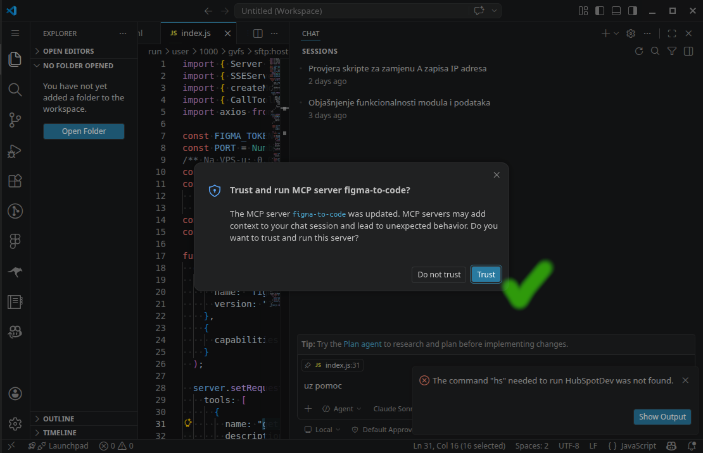

# Spec-First AI Development Framework

A structured methodology for AI-assisted software development. Ensures traceability, quality gates, and consistent outputs across projects.

## Installation

### Option A: Install as a Plugin (Recommended)

#### Cursor

Run inside Cursor:

```
/add-plugin zlatkomq/spec-first-framework
```

Or browse and install from the [Cursor Marketplace](https://cursor.com/marketplace).

#### Claude Code

```bash
claude plugin marketplace add zlatkomq/spec-first-framework
claude plugin install spec-first-framework@spec-first-framework --scope project
```

Or inside Claude Code:

```
/plugin marketplace add zlatkomq/spec-first-framework
/plugin install spec-first-framework@spec-first-framework
```

#### OpenCode

See [.opencode/INSTALL.md](.opencode/INSTALL.md) for manual setup (symlink plugin and skills directory).

### Option B: Install via CLI

#### Install the CLI

```bash
sudo curl -fsSL https://raw.githubusercontent.com/zlatkomq/spec-first-framework/main/spec-first.sh -o /usr/local/bin/spec-first && sudo chmod +x /usr/local/bin/spec-first
```

#### Initialize a project

```bash
cd your-project
spec-first init
```

#### Update to latest framework

```bash
spec-first update
```

#### Switch to a different branch

```bash
spec-first update --branch <branch-name>
```

#### Install Cursor Metrics Hook

Installs the [cursor-metrics](https://github.com/zlatkomq/cursor-metrics) hook into `~/.cursor/` so every agent session automatically reports usage metrics.

```bash
spec-first install-hook
```

The command downloads `send-metrics.py` into `~/.cursor/hooks/` and creates (or preserves) `~/.cursor/hooks.json` with `stop` and `subagentStop` entries.

| Option | Description |
|--------|-------------|
| `--url <script-url>` | Override the download URL for `send-metrics.py` |
| `CURSOR_METRICS_URL` | Environment variable — sets the ingest endpoint (default: `http://localhost:8000`) |

After installation, restart Cursor to activate. Debug logs are written to `~/.cursor/hooks-logs/stop-events.jsonl`.

#### CLI Commands

| Command | Description |
|---------|-------------|
| `spec-first init` | Install framework into current project |
| `spec-first update` | Pull latest rules/templates (preserves specs, bugs, constitution) |
| `spec-first update --branch <name>` | Switch to a different framework branch |
| `spec-first install-hook` | Install cursor-metrics hook for the current user |
| `spec-first version` | Show installed framework version |

## Quick Start

1. Install the framework with `spec-first init` (or manually copy `.cursor/` and `.framework/` folders into your project)
2. Create `CONSTITUTION.md` using: `/constitute` + your project description
3. For each spec, follow the workflow: SPEC → DESIGN → **UIX (Figma, optional)** → TASKS → Implementation → Review

**Commands** (in `.cursor/commands/`): `/constitute`, `/specify`, `/design`, `/uix`, `/tasks`, `/implement`, `/review`, `/flow`, `/bug`, `/bugfix`, `/bugreview`, `/change`, `/adversarial`, `/debug`, `/validate` — see [Commands & Workflow Example](docs/COMMANDS-WORKFLOW-EXAMPLE.md).

**Guided workflow (recommended):** Use **`/flow 001-slug: requirements`** to run the full feature workflow step by step (BMAD-style: state + step files + menus). Resume anytime with **`/flow 001`**. Go back with **[B]**, continue with **[C]**. See [Workflow return and continue](docs/WORKFLOW-RETURN-AND-CONTINUE.md).

## Workflow

### Feature Workflow

```
STEP 0: CONSTITUTION.md (once per project)
         ↓
STEP 1: SPEC.md → Gate 1 (PO approves)
         ↓
STEP 2: DESIGN.md → Gate 2 (Tech Lead approves)
         ↓
STEP 2b: UIX-SPEC.md (Figma mapping + cached `figma/` snapshot) — optional; see [Figma and UIX flow](#figma-and-uix-flow-layout-handoff) below
         ↓
STEP 3: TASKS.md → Gate 3 (Tech Lead approves)
         ↓
STEP 4: Implementation (all tasks; reads cached `figma/` snapshot when present)
         ↓
STEP 5: Code Review → Gate 4 (Reviewer approves) → Done
```

### Bugfix Workflow

```
BUG REPORTED + Original SPEC.md reference
         ↓
STEP 1: BUG.md → Gate 1 (Tech Lead confirms)
         ↓
STEP 2: Implementation (fix + regression test)
         ↓
STEP 3: Bug Review → Gate 2 (Reviewer approves)
         ↓
Update original SPEC.md Bug History → Done
```

### Change Request Workflow

```
SCOPE CHANGE IDENTIFIED
         ↓
/change 001: [Jira ticket or description]
         ↓
Classification check (bug vs CR)
         ↓
Impact analysis → Change Proposal document
         ↓
User approves → Update SPEC/DESIGN/TASKS, Amendment History, SPEC-CURRENT.md
```

## BMAD Fusion (Agency & Quality Enhancements)

This framework includes **BMAD fusion** enhancements: agency-ready metadata, change requests, classification checks, and stricter implementation/review gates.

### Agency Metadata

All spec artifacts support traceability fields for billing and audit:

- **Gate metadata:** Approved By, Approval Date, Jira Ticket on SPEC, DESIGN, and TASKS
- **Workflow state:** `jiraTicket` and `sowRef` in `.workflow-state.md` for Jira/SOW linking
- **Bug History** and **Amendment History** in SPEC.md — updated automatically when bugs are fixed or change requests are implemented

### Additional Commands

| Command | Purpose |
|---------|---------|
| `/change {spec}` | Handle scope changes. Produces a Change Proposal with impact analysis. On approval, updates artifacts and regenerates SPEC-CURRENT.md. |
| `/adversarial` | Review any content (spec, design, doc) with extreme skepticism. Finds at least 10 issues. Use before approving a gate or to sanity-check a document. |
| `/debug` | Investigate a bug, test failure, or unexpected behavior using systematic root-cause methodology. For investigation before fixing — separate from `/bug` and `/bugfix`. |
| `/validate` | Framework integrity check. Verifies all step files, templates, checklists, skills, adapters, and cross-references are present and valid. |

### Classification Check

When `/bug` or `/change` is run with a Jira ticket (or ticket description), the framework compares the ticket against SPEC.md acceptance criteria and flags misclassification:

- **Bug reported but no AC violated** → "This may be a Change Request. Consider `/change`."
- **CR requested but it fixes an AC violation** → "This may be a Bug. Consider `/bug`."

Reduces billing disputes and keeps bug vs scope-change work clearly separated.

### Figma and UIX flow (layout handoff)

When the feature has UI in **Figma**, the `/flow` guided path runs **step 2b** after an approved DESIGN (see `.framework/steps/step-02b-uix.md` and `skills/uix-creation/SKILL.md`). Designers, the agent, and developers all share one source of truth: a fetched-once snapshot of the Figma file living on disk in the spec folder.

#### Architecture

```
┌──────────────────┐       ┌───────────────────────┐       ┌──────────────────────┐
│  Designer        │       │  figma-to-code MCP    │       │  Spec-First /uix     │
│  (Figma file)    │──────▶│  (separate server,    │──────▶│  (this framework,    │
│                  │  read │   open source)        │ tools │   /flow step 2b)     │
│  follows         │       │                       │       │                      │
│  FIGMA-DESIGNER- │       │  github.com/zlatkomq/ │       │  caches results to   │
│  GUIDE.md        │       │  figma-mcp            │       │  specs/XXX/figma/    │
└──────────────────┘       └───────────────────────┘       └──────────────────────┘
```

Two pieces, deployed independently:

1. **`figma-to-code` MCP server** — open-source Node/Docker service that translates Figma REST API responses into deterministic, code-ready JSX + tokens. Lives in its own repo: **[github.com/zlatkomq/figma-mcp](https://github.com/zlatkomq/figma-mcp)**.
2. **Spec-First Framework (this repo)** — the `/uix` step that calls the MCP, caches the result, and treats the on-disk cache as the single source of truth for the rest of the workflow.

#### Setup

##### For designers

Send your design team [**docs/FIGMA-DESIGNER-GUIDE.md**](docs/FIGMA-DESIGNER-GUIDE.md). It documents the naming, layout, frames vs groups, components, text, colors, icons (`svg_ex_` prefix), and grid conventions that make extraction deterministic. Following this guide is the difference between pixel-accurate generated code and approximations.

##### For developers (one-time per machine)

1. **Deploy the `figma-to-code` MCP server.** Follow the [Installation section in the figma-mcp README](https://github.com/zlatkomq/figma-mcp#installation) — three options: local Node, Docker, or stdio. You'll need a Figma Personal Access Token; the token is configured on the **server** (in `.env`), not on developer machines.

2. **Configure your editor to attach to the MCP.** Pick the section for your editor in the [figma-mcp README's MCP client configuration](https://github.com/zlatkomq/figma-mcp#mcp-client-configuration) — Cursor, Claude Code, or OpenCode are all covered. Minimal Cursor example (replace `127.0.0.1` with the server's reachable address):

   ```json
   {
     "mcpServers": {
       "figma-to-code": {
         "url": "http://127.0.0.1:3000/mcp"
       }
     }
   }
   ```

   The repo includes a root [`mcp.json`](mcp.json) as a reference snippet you can copy from. **Restart your editor** after editing the config.

3. **Trust the MCP server in your editor.** Cursor shows a *"Trust and run MCP server figma-to-code?"* dialog the first time — click **Trust**. (Equivalent prompts in Claude Code / OpenCode.)

   

4. **Verify the install.** Follow the [Verification section](https://github.com/zlatkomq/figma-mcp#verification) in the figma-mcp README. Quick check: in your editor, ask the agent *"List MCP tools available from figma-to-code"* — you should see five tools (`get_figma_file_structure`, `get_figma_design_tokens`, `get_figma_node_spec`, `get_figma_frame_with_image`, `export_figma_assets`).

5. **Install the Spec-First plugin** if you haven't already (see the [Installation section](#installation) above) — this provides the `/uix` and `/uix-refresh` slash commands and the `skills/uix-creation/` skill.

##### Q Agency internal deployment

Q Agency runs the `figma-to-code` stack on the internal RACK (under `/home/DOCKER_MCP_DATA/`) on a VPN-only address. Internal developers replace `127.0.0.1` in the Cursor/Claude Code/OpenCode config with the internal URL and must be on the VPN. External users and clients should run their own instance using the [figma-mcp repo](https://github.com/zlatkomq/figma-mcp).

#### What happens at step 2b

| Phase | What happens |
|--------|----------------|
| **UIX spec** | You create **`specs/<id-slug>/UIX-SPEC.md`**: maps DESIGN.md segments to Figma file URLs and `node-id` deep links (template: `.framework/templates/UIX-SPEC.template.md`). |
| **Cached design context (fetch once)** | The agent calls the granular tool sequence on `figma-to-code` v2.0.0+: `get_figma_file_structure` → `get_figma_design_tokens` → `get_figma_node_spec` per design segment, optionally `get_figma_frame_with_image` and `export_figma_assets`. Every response is saved under **`specs/<id-slug>/figma/`** (`tokens.css`, `<node-id>.md`, optional `<node-id>.png`, `assets/`). |
| **Single source of truth** | The files in `figma/` are the **definitive design context** for the rest of the workflow. UIX-SPEC.md's **Design Context Artifacts** table lists every cached file with its relative path. |
| **Implementation (step 4)** | `.framework/steps/step-04-implement.md` reads `UIX-SPEC.md` and **all files under `figma/`** as the design context. **Step 4 never calls the MCP** — it reads from disk only. Single-pass implementation per task; observed visual mismatches are recorded once in `figma/drift-T<n>.md` and surfaced to step 5. |
| **Review (step 5)** | `.framework/steps/step-05-review.md` reads the same cached `figma/` files plus `drift-T*.md`. Unchecked drift items become Major findings. **Step 5 never calls the MCP.** |
| **Refresh (`/uix-refresh`)** | The **only** path that re-calls the MCP after step-02b. Run `/uix-refresh {spec_id}` (or pick `[F] Force refresh` in step-02b's menu) to delete the listed `figma/` files and re-fetch them. Drift files (`figma/drift-T*.md`) are preserved. |

**No fidelity loop, no automatic re-fetch.** Once design context is cached in `figma/`, agents must read from disk. Calling the MCP for a file that already exists on disk — outside of `/uix-refresh` — is a failure condition reported by step 5.

#### `svg_ex_` node convention — automatic SVG export

Any Figma node whose name starts with **`svg_ex_`** is treated as a standalone SVG asset. The `figma-to-code` MCP server identifies these nodes automatically. When such a node is encountered the agent **must** call `export_figma_assets` for it (format `"svg"`) and save the result to **`specs/<id-slug>/figma/assets/<node-name>.svg`**. That cached `.svg` file is then the **only** allowed source for the graphic in generated code and specs — it must be referenced by its relative path (e.g. `./figma/assets/svg_ex_logo.svg`) and must never be inlined or substituted with a placeholder. The standard cache policy applies: if the file already exists on disk, read from disk and do not call the MCP again.

#### No Figma for this spec?

Step 2b is optional. If a spec has no UI work (backend-only, infrastructure, refactor), pick `[S] Skip UIX` in the step's menu. `.workflow-state.md` records `uixSkipped: true` and the workflow auto-continues to Task Breakdown.

#### CLI alternative

If your team prefers a custom Node script over the `figma-to-code` MCP server, you can produce the same on-disk shape with your own tooling — save files into the spec's `figma/` directory using the same names (`tokens.css`, `<node-id>.md`, `<node-id>.png`, `assets/...`) and list them in UIX-SPEC's **Design Context Artifacts** table so step 4 reads them as the cached snapshot. The framework only cares about the on-disk contract, not who fills it.

### SPEC-CURRENT.md

After a bug is fixed or a change request is implemented, the framework can regenerate **SPEC-CURRENT.md**: a compiled view of the current specification (frozen SPEC + all applied bug fixes + all applied amendments). Use it as the single "current state" reference without editing SPEC.md by hand.

### Implementation & Review Enhancements

- **Test-accompaniment:** Every implementation task must produce tests alongside code; per-task validation gates (tests exist, pass, ACs satisfied) before marking complete.
- **Implementation summary:** After implementing all tasks, an IMPLEMENTATION-SUMMARY.md is written to the spec folder with files changed, key decisions, patterns established, and test results.
- **Review continuation:** If code review finds issues, you can choose **[F] Fix automatically** (AI fixes and re-reviews) or **[B] Back to Implement** (return to step 4 with review findings as context).
- **Issue count policy:** Review verdicts: &lt;3 issues (re-examine/justify), 3–10 (CHANGES REQUESTED), &gt;10 (BLOCKED — recommend re-implementing from TASKS rather than patching).
- **Verification gate:** Step 4 runs a pre-flight verification checklist (see `.framework/checklists/verification-checklist.md`) after implementation before allowing Continue to review.

See [CHANGELOG.md](CHANGELOG.md) for the full list of changes in this release.

## Folder Structure

```
your-project/
├── skills/                            # Cross-platform AI skills (SKILL.md open standard)
│   ├── spec-creation/SKILL.md         #   Cursor 2.4+, Claude Code, OpenCode, Codex, Gemini CLI
│   ├── constitution-creation/SKILL.md
│   ├── design-creation/SKILL.md
│   ├── uix-creation/SKILL.md          # UIX-SPEC + cached Figma context (figma/ dir)
│   ├── task-creation/SKILL.md
│   ├── implementation/SKILL.md
│   ├── subagent-driven-development/SKILL.md  # Multi-task orchestration via subagents
│   ├── code-review/SKILL.md
│   ├── adversarial-review/SKILL.md
│   ├── bugfixing/SKILL.md
│   ├── bug-implementation/SKILL.md
│   ├── bug-review/SKILL.md
│   ├── change-request/SKILL.md
│   ├── git-worktrees/SKILL.md         # Workspace isolation (feature branches)
│   ├── finishing-development-branch/SKILL.md  # Branch merge / PR / cleanup
│   └── systematic-debugging/SKILL.md  # Root-cause investigation (/debug)
├── .cursor-plugin/plugin.json         # Cursor adapter
├── .claude-plugin/plugin.json         # Claude Code adapter
├── .opencode/                         # OpenCode plugin (see .opencode/INSTALL.md for setup)
├── .cursor/
│   └── commands/                      # Cursor slash commands (16 commands)
│       ├── constitute.md              #   /constitute — project standards
│       ├── specify.md                 #   /specify — create SPEC.md
│       ├── design.md                  #   /design — create DESIGN.md
│       ├── uix.md                     #   /uix — create UIX-SPEC.md (Figma)
│       ├── tasks.md                   #   /tasks — create TASKS.md
│       ├── implement.md               #   /implement — implement tasks
│       ├── review.md                  #   /review — code review
│       ├── flow.md                    #   /flow — guided end-to-end workflow
│       ├── bug.md                     #   /bug — create BUG.md
│       ├── bugfix.md                  #   /bugfix — implement bug fix
│       ├── bugreview.md               #   /bugreview — review bug fix
│       ├── change.md                  #   /change — scope change request
│       ├── adversarial.md             #   /adversarial — extreme skepticism review
│       ├── debug.md                   #   /debug — systematic root-cause investigation
│       ├── uix-refresh.md             #   /uix-refresh — explicit re-fetch of cached Figma snapshot
│       └── validate.md               #   /validate — framework integrity check
├── .framework/
│   ├── steps/                         # BMAD-style step files for /flow (7 files)
│   │   ├── step-00-continue.md        #   Resume logic
│   │   ├── step-01-spec.md            #   Create SPEC.md
│   │   ├── step-02-design.md          #   Create DESIGN.md
│   │   ├── step-02b-uix.md            #   UIX-SPEC + cached figma/ snapshot (optional)
│   │   ├── step-03-tasks.md           #   Create TASKS.md
│   │   ├── step-04-implement.md       #   Implement tasks
│   │   └── step-05-review.md          #   Code review
│   ├── templates/                     # Document templates (11 files)
│   │   ├── SPEC.template.md
│   │   ├── DESIGN.template.md
│   │   ├── UIX-SPEC.template.md       # Figma mapping template
│   │   ├── TASKS.template.md
│   │   ├── REVIEW.template.md
│   │   ├── BUG.template.md
│   │   ├── BUG-REVIEW.template.md
│   │   ├── CONSTITUTION.template.md
│   │   ├── workflow-state.template.md
│   │   ├── CHANGE-PROPOSAL.template.md
│   │   └── SPEC-CURRENT.template.md
│   └── checklists/
│       └── verification-checklist.md  # Step 4 verification gate
├── mcp.json                           # Reference MCP config (figma-to-code server)
├── CONSTITUTION.md              ← You create this (project root)
├── specs/
│   └── XXX-description/
│       ├── .workflow-state.md         ← Created by /flow (tracks progress)
│       ├── SPEC.md
│       ├── DESIGN.md
│       ├── UIX-SPEC.md               # Optional: Figma URLs + Design Context Artifacts table
│       ├── figma/                    # Optional: cached design context (fetch-once snapshot)
│       │   ├── tokens.css            #   Design tokens (only allowed source for hex/font)
│       │   ├── 123-456.md            #   Per-node JSX prop tree + geometry
│       │   ├── 123-456.png           #   Optional visual reference
│       │   ├── assets/               #   Optional exported icons/images
│       │   └── drift-T3.md           #   Optional one-shot drift record from step-04
│       ├── TASKS.md
│       ├── IMPLEMENTATION-SUMMARY.md  ← Written after implementation (step 4)
│       └── REVIEW.md
├── bugs/
│   └── BUG-XXX-description/
│       ├── BUG.md
│       └── REVIEW.md
└── src/
```

## Usage

All steps can be run via the slash commands below. See [Commands & Workflow Example](docs/COMMANDS-WORKFLOW-EXAMPLE.md) for details.

### Step 0: Project Setup (once)

```
/constitute Python 3.12, FastAPI, PostgreSQL, pytest 80% coverage, REST API
```

### Step 1: Create Specification

```
/specify 001-user-authentication: [paste requirements from PO/client]
```

### Step 2: Create Technical Design

```
/design 001
```

### Step 2b: UIX / Figma mapping (optional)

Use after DESIGN is approved when you have Figma links—with **`/flow`** this is step 2b, or invoke explicitly:

```
/uix 001 https://www.figma.com/design/<file-key>/...
```

The agent writes **`UIX-SPEC.md`** and, when **`figma-to-code` v2.0.0+** MCP is available, fetches design context **once** via the granular tool sequence and saves it under **`specs/<id-slug>/figma/`** (`tokens.css`, `<node-id>.md`, optional `<node-id>.png`, `assets/`). Steps 4 and 5 read these files from disk; they never re-call the MCP. To refresh later, run `/uix-refresh {spec_id}`. See [Figma and UIX flow](#figma-and-uix-flow-layout-handoff).

### Step 3: Create Task Breakdown

```
/tasks 001
```

### Step 4: Implement

```
/implement 001
```

### Step 5: Review

```
/review 001
```

### Debug (investigate failures)

```
/debug tests failing in auth module after adding session middleware
```

The agent applies systematic root-cause analysis before suggesting fixes. Use this before `/bug` when you need investigation, not a formal bug report.

---

## Bugfix Usage

### Step 1: Create Bug Report

```
/bug 001-user-registration: Email validation passes for "user@domain" (missing TLD). Steps: Enter "test@domain", click register, succeeds but shouldn't.
```

### Step 2: Implement Fix

```
/bugfix T1 from BUG-001
```

### Step 3: Review Fix

```
/bugreview BUG-001
```

After approval, update the original SPEC.md Bug History table.

---

## When to Use Each Workflow

| Situation | Workflow |
|-----------|----------|
| New feature or enhancement | Feature workflow (SPEC.md) |
| Code violates existing acceptance criteria | Bugfix workflow (BUG.md) |
| Scope change, new requirement, or client request | Change request: `/change {spec}` |
| Acceptance criteria was missing or wrong | Feature workflow (narrow spec) |
| Refactoring without behavior change | Feature workflow (Type: Refactor) |
| Performance optimization | Feature workflow (Type: Performance) |
| Database/system migration | Feature workflow (Type: Migration) |
| Trivial fix you made yourself (typo, config, one-liner) | Quick fix convention (no workflow) |
| Sanity-check a spec/design/doc before approving | `/adversarial` (finds 10+ issues) |
| Something broke and you need root-cause analysis | `/debug` (systematic investigation) |
| Verify framework files are complete and consistent | `/validate` (integrity check) |

Note: Dedicated workflows for Refactor, Performance, and Migration may be added in future versions.

### Quick Fixes (No Workflow Needed)

For obvious fixes you make yourself (typos, config tweaks, one-liners):

1. Fix it
2. Commit with prefix: `quickfix(FEAT-XXX): description`
3. Optionally update SPEC.md Bug History table

No commands, no AI, no ceremony. The git log is your traceability. Find all quick fixes for a spec with `git log --grep="quickfix(FEAT-001)"`.

Use `/bug` instead if the fix needs investigation, touches many files, or carries risk.

## Documentation

- [CHANGELOG.md](CHANGELOG.md) — Release history and version details
- [FOLDER-STRUCTURE.md](FOLDER-STRUCTURE.md) — Detailed folder and file descriptions (includes UIX / cached `figma/` snapshot if present)
- [Commands & Workflow Example](docs/COMMANDS-WORKFLOW-EXAMPLE.md) — Using slash commands (`/specify`, `/design`, etc.)
- [Live Workflow Demo](docs/WORKFLOW-DEMO.md) — End-to-end walkthrough of building 001 User Registration, with prompts and AI responses at each step
- [Workflow return and continue](docs/WORKFLOW-RETURN-AND-CONTINUE.md) — Resume or go back a step, then continue (`/flow 001`)
- [BMAD Fusion — Change Request Summary](docs/BMAD-FUSION-CHANGES.md) — Full list of BMAD fusion changes (templates, rules, steps)
- [UIX / Figma Injection Overview](docs/UIX-FIGMA-INJECTION-OVERVIEW.md) — Technical analysis of the UIX integration approach
- [Figma Designer Guide](docs/FIGMA-DESIGNER-GUIDE.md) — **For designers.** Naming, layout, components, and asset rules so the `figma-to-code` MCP extracts pixel-accurate specs. Send this to your designers before they build the first Figma file for a Spec-First project.
- [PHILOSOPHY.md](PHILOSOPHY.md) — Framework principles and design rationale

## Testing

The framework ships with an automated regression suite under [`tests/`](tests/) covering every skill in `skills/`.

```bash
cd tests
./run-skill-tests.sh                              # all 16 skill tests (~15–20 min)
./run-skill-tests.sh --test test-uix-creation.sh  # single test
./run-skill-tests.sh --verbose                    # show per-assertion output
```

Two test layers:

| Layer | Location | What it verifies |
|---|---|---|
| **Skill tests** (16 files, 56+ assertions) | `tests/test-<skill>.sh` | Each skill loads via the plugin and states its hard-gate rules correctly under questioning (e.g. "TDD iron law", "DESIGN must be APPROVED", "no MCP from step-04"). |
| **E2E scenarios** (13 scenarios) | `tests/e2e/scenarios/<skill>/` | Run full workflow scenarios — happy paths plus gate-failure paths — and assert on real artifact contents. Driven by `tests/e2e/run-e2e-tests.sh`. |

Tests use the **real** Claude Code CLI in headless mode (`claude -p`) with the plugin auto-loaded — no mocks. See [`tests/README.md`](tests/README.md) for the full assertion map and how to add a new test.

## Status

| Workflow | Status | Version |
|----------|--------|---------|
| Greenfield (feature) | ✅ Complete | 0.4.0+ |
| Bugfix | ✅ Complete | 0.5.0+ |
| Change request | ✅ Complete | 0.7.0+ |
| UIX / Figma handoff | ✅ Complete | 1.2.0 (cached snapshot model) |
| Brownfield (legacy) | 🚧 Planned | — |

**Current version:** 1.2.0 — see [CHANGELOG.md](CHANGELOG.md) for details. The plugin manifests (`.claude-plugin/plugin.json`, `.claude-plugin/marketplace.json`, `.cursor-plugin/plugin.json`) and the framework release line are aligned on the same version.
