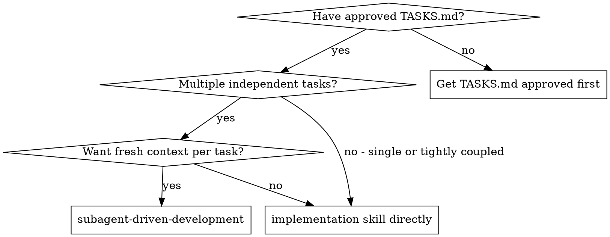
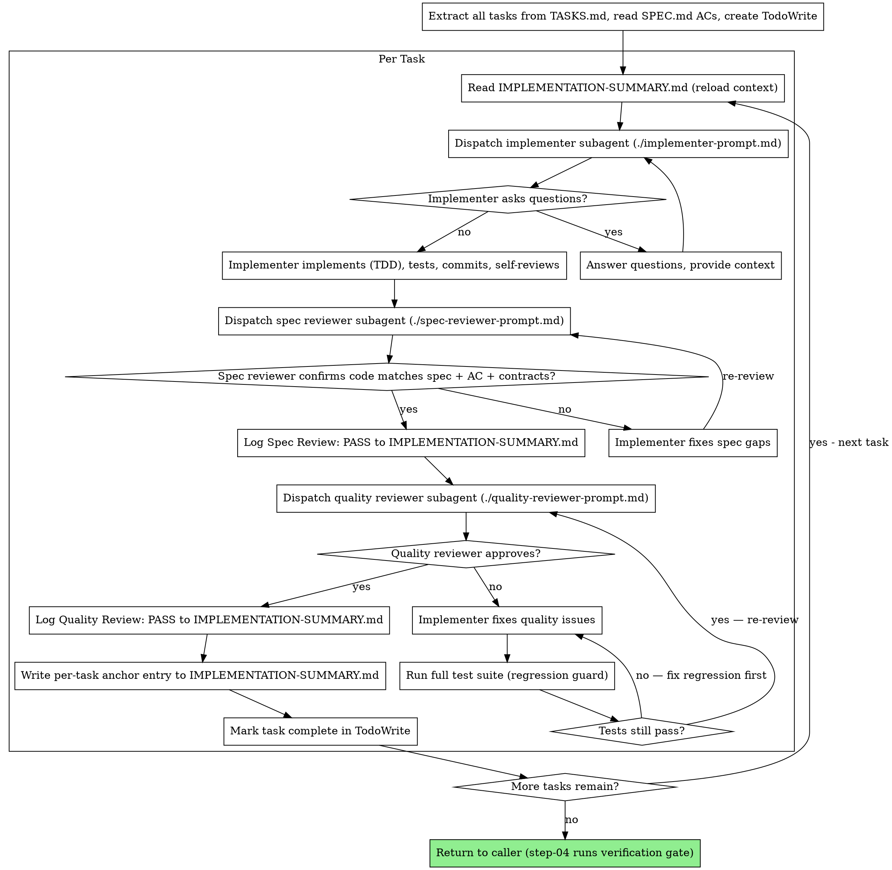

# Subagent-Driven Development

## Description

Use when implementing code from an approved TASKS.md with multiple independent tasks. Dispatches a fresh subagent per task with two-stage review (spec compliance, then code quality) after each.
Not for single-task implementations — use the implementation skill directly. Not for code review — use the code-review skill.

## Instructions

You are the **controller**. Your job is to orchestrate task execution by dispatching subagents and managing review gates. You do NOT implement code yourself.

### When to Use



**vs. Implementation skill directly:**
- Fresh subagent per task (no context pollution between tasks)
- Two-stage review after each task: spec compliance first, then code quality
- Subagents can ask questions before starting (question gate)
- Issues caught per-task, not at the end

### Required Inputs

Before starting, you must have:
- Approved TASKS.md (load `specs/XXX/TASKS.md`) — Status must be APPROVED
- Access to `specs/XXX/SPEC.md` for acceptance criteria
- Access to `specs/XXX/DESIGN.md` for technical approach
- Access to `../../CONSTITUTION.md` for coding standards

If TASKS.md is not approved (Status != APPROVED), STOP and inform the user.

### Workspace Isolation

Before starting, use the `../../skills/git-worktrees/SKILL.md` skill to set up an isolated workspace. The skill will detect if you are already inside a worktree and skip creation if so.

### Controller Responsibilities

```
CRITICAL: Read TASKS.md once. Extract ALL tasks upfront. Never re-read per task.
```

At the start, before dispatching any subagent:
1. Read TASKS.md once — extract every task with its full text, Produces/Consumes declarations, and Verify commands
2. Read SPEC.md once — note which acceptance criteria each task addresses
3. Read DESIGN.md once — note architectural context and component relationships
4. Read CONSTITUTION.md once — extract project standards (coding conventions, naming rules, file structure, test framework, test commands, coverage thresholds)
5. Create TodoWrite with all tasks
6. Read IMPLEMENTATION-SUMMARY.md if it exists (re-entry scenario)

**Do NOT:**
- Re-read TASKS.md for each task
- Make subagents read TASKS.md, SPEC.md, DESIGN.md, or CONSTITUTION.md
- Summarize task text — provide it in full

**Do:**
- Provide each subagent with complete task text (from upfront extraction)
- Provide relevant acceptance criteria (from SPEC.md)
- Provide Produces/Consumes declarations (from TASKS.md)
- Provide project standards in the `## Project Standards` section of BOTH the implementer prompt AND the quality reviewer prompt (from CONSTITUTION.md — coding conventions, naming rules, file structure, test framework, test commands, coverage thresholds, error handling patterns, security standards)
- Provide relevant DESIGN.md context in the `## Design Context` section of the quality reviewer prompt (architecture decisions, data models, API/interface designs, component relationships, dependency choices relevant to this task)
- Provide scene-setting context (from IMPLEMENTATION-SUMMARY.md and previous task results)

<HARD-GATE>
After EVERY implementer subagent reports, you MUST:
1. Dispatch spec compliance reviewer (./spec-reviewer-prompt.md) — NO EXCEPTIONS
2. Wait for PASS — if FAIL, implementer fixes, re-review
3. ONLY THEN dispatch quality reviewer (./quality-reviewer-prompt.md)
4. Wait for PASS — if FAIL, implementer fixes, regression guard, re-review

Skipping either review for ANY reason (context limits, time pressure, "obvious" task,
controller self-review instead) is a HALT violation. If you catch yourself about to skip
a review, STOP and dispatch it.
</HARD-GATE>

### The Process



### Prompt Templates

- `./implementer-prompt.md` — Dispatch implementer subagent for each task
- `./spec-reviewer-prompt.md` — Dispatch spec compliance reviewer after implementation
- `./quality-reviewer-prompt.md` — Dispatch code quality reviewer after spec compliance passes

### IMPLEMENTATION-SUMMARY.md Integration

Gate results are logged as part of each task's anchor entry. The format extends the standard anchor entry from the implementation skill:

```
### T{N}: {task title}
**Files:** {created: [list] | modified: [list]}
**Patterns:** {pattern established or followed | "None"}
**Decisions:** {decisions affecting future tasks | "None"}
**Deviations:** {deviations from DESIGN.md with reason | "None"}
**Spec Review:** PASS [YYYY-MM-DD HH:MM] | FAIL (attempt N) [YYYY-MM-DD HH:MM] — [issues summary]
**Quality Review:** PASS [YYYY-MM-DD HH:MM] | FAIL (attempt N) [YYYY-MM-DD HH:MM] — [issues summary]
```

Rules:
- **Token budget:** Each entry MUST be 100-250 tokens. List paths only, no file contents or test details.
- **First task:** Creates the file with `## Implementation Summary` header followed by the first anchor entry.
- **Subsequent tasks:** Append below the previous entry.
- **Re-read before each task:** Before dispatching each task's implementer, read the entire IMPLEMENTATION-SUMMARY.md to reload context. Treat it as authoritative.
- **Gate results logged immediately:** Log spec review result as soon as it returns, before dispatching quality reviewer. Log quality review result as soon as it returns, before writing the full anchor entry.

After ALL tasks complete, finalize IMPLEMENTATION-SUMMARY.md by appending aggregate sections following the format in `../../skills/implementation/SKILL.md`. Then return to the caller (step-04) which runs the verification gate.

### Example Workflow

```
You: I'm using Subagent-Driven Development for spec 003-payment-gateway.

[Read TASKS.md once: specs/003-payment-gateway/TASKS.md]
[Extract all 3 tasks with full text, Produces/Consumes, Verify commands]
[Read SPEC.md: note acceptance criteria AC-1 through AC-7]
[Create TodoWrite with all tasks]

Task 1: Create PaymentGateway interface (DESIGN: Architecture)
  Produces: PaymentGateway.charge(amount: Money, token: string) -> ChargeResult

[Read IMPLEMENTATION-SUMMARY.md — does not exist yet (first task)]
[Dispatch implementer subagent with:
  - Full T1 text
  - Produces: PaymentGateway.charge(amount: Money, token: string) -> ChargeResult
  - AC-1: "Given valid payment token, when charge requested, then returns success with transaction ID"
  - AC-2: "Given invalid token, when charge requested, then returns failure with error code"
  - Context: "First task. Establishing the core interface."
  - Worktree path]

Implementer: "Should Money be a value object or a primitive type?"

You: "Value object — see DESIGN.md Architecture section, Money class with amount and currency."

Implementer: "Got it. Implementing now..."
[Later] Implementer:
  - Implemented PaymentGateway interface with charge method
  - TDD: wrote 4 tests first (2 success, 2 failure scenarios), then implemented
  - Produces signature matches exactly
  - AC-1 traced: src/gateways/payment.ts (PaymentGateway.charge) + tests/gateways/payment.test.ts (test_charge_success)
  - AC-2 traced: src/gateways/payment.ts (PaymentGateway.charge) + tests/gateways/payment.test.ts (test_charge_invalid_token)
  - 4/4 tests pass, full suite 47/47 pass
  - Committed: abc1234

[Dispatch spec reviewer with T1 text + AC-1,AC-2 + Produces + implementer report]
Spec reviewer:
  - AC-1: PASS — charge() returns ChargeResult with transactionId on valid token
  - AC-2: PASS — charge() returns ChargeResult with errorCode on invalid token
  - Produces: PASS — PaymentGateway.charge(amount: Money, token: string) -> ChargeResult matches exactly
  - No extra work found
  PASS

[Log to IMPLEMENTATION-SUMMARY.md: Spec Review: PASS 2026-02-21 14:30]

[Get git SHAs, dispatch quality reviewer with task context + Design Context + commit range]
Quality reviewer:
  Strengths: Clean interface, good test coverage, TDD followed
  Issues: None
  Assessment: APPROVED

[Log to IMPLEMENTATION-SUMMARY.md: Quality Review: PASS 2026-02-21 14:35]
[Write per-task anchor entry]
[Mark Task 1 complete]

Task 2: Create StripeAdapter (DESIGN: Architecture - StripeAdapter)
  Consumes: T1.PaymentGateway
  Produces: StripeAdapter implements PaymentGateway

[Read IMPLEMENTATION-SUMMARY.md — reload T1 context, patterns, decisions]
[Dispatch implementer subagent with T2 text + Consumes/Produces + AC-3,AC-4 + T1 context]

Implementer: [No questions, proceeds]
Implementer:
  - Implemented StripeAdapter
  - TDD: 6 tests, all pass
  - Full suite 53/53 pass
  - Committed: def5678

[Dispatch spec reviewer]
Spec reviewer:
  - AC-3: PASS
  - AC-4: FAIL — Missing: spec says "retry on network error up to 3 times" but no retry logic found
  FAIL

[Implementer fixes: adds retry logic with 3 attempts]
[Spec reviewer re-reviews]
Spec reviewer: PASS — retry logic verified, all ACs satisfied

[Log: Spec Review: PASS 2026-02-21 15:10]

[Dispatch quality reviewer with Design Context + commit range]
Quality reviewer:
  Issues (Minor): Magic number 3 for retry count — extract to constant
  Assessment: ISSUES FOUND

[Implementer fixes: extracts MAX_RETRY_ATTEMPTS constant]
[Run full test suite (regression guard): 53/53 pass — no regressions]
[Quality reviewer re-reviews]
Quality reviewer: APPROVED

[Log: Quality Review: PASS 2026-02-21 15:20]
[Write per-task anchor entry]
[Mark Task 2 complete]

...

[After all tasks complete]
[Finalize IMPLEMENTATION-SUMMARY.md — append aggregate sections]
[Return to caller (step-04 runs verification gate, then proceeds to step-05 code review)]
Done!
```

### Advantages

**vs. Implementation skill directly:**
- Fresh context per task (no confusion from accumulated context)
- Parallel-safe (subagents don't interfere)
- Two-stage review catches issues per-task, not at the end
- Subagent can ask questions before starting

**Quality gates:**
- Self-review catches issues before handoff
- Spec compliance review prevents over/under-building and verifies AC tracing
- Code quality review ensures standards compliance
- Review loops ensure fixes actually work
- Interface contract verification prevents integration surprises

**Traceability:**
- Every gate result logged to IMPLEMENTATION-SUMMARY.md with timestamp
- Acceptance criteria traced to code AND test per-task
- Produces/Consumes verified per-task
- Full audit trail from SPEC.md → code → test → review gate

**Efficiency:**
- No file reading overhead (controller provides full text)
- Controller curates exactly what context is needed
- Questions surfaced before work begins (not after)
- Issues caught early (cheaper than debugging later)

**Cost:**
- More subagent invocations (implementer + 2 reviewers per task)
- Controller does more prep work (extracting all tasks upfront)
- Review loops add iterations
- But catches issues early — cheaper than finding them in final review

### Re-Review Loop Rules

When a reviewer finds issues:
1. **Resume the implementer subagent** (by agent ID) if the platform supports it. Otherwise, dispatch a **new fix subagent** with: (a) original task context, (b) the implementer's report, (c) the reviewer's specific findings, and (d) instruction to fix only the cited issues.
2. The **same reviewer** reviews again (not a different reviewer)
3. Loop continues until approved
4. **Maximum 3 attempts per review gate** — if 3 failures on the same gate for the same task, HALT. The problem is likely in the spec, not the implementation.

**Quality fix regression guard:** After the implementer fixes quality issues, the controller must run the full test suite before dispatching the quality re-reviewer. If any previously-passing test now fails, do NOT dispatch the quality re-reviewer. Instead, route back to the implementer with both the original quality issues AND the regression. This prevents quality fixes from silently breaking spec compliance. **Regression failures count toward the quality review attempt limit** (max 3 total — whether the failure comes from the reviewer or from the regression guard).

### Halt Conditions

STOP and inform the user if any of these occur:

| Condition | Action |
|-----------|--------|
| TASKS.md not APPROVED | HALT — do not start |
| Spec review fails 3 times for same task | HALT — problem is in the spec or task definition, not the implementation. Recommend revisiting TASKS.md or SPEC.md. |
| Quality review fails 3 times for same task | HALT — likely an architectural issue. Recommend revisiting DESIGN.md. |
| Subagent cannot resolve question | HALT — ask user for clarification |
| Missing dependency from another task | HALT — inform user which task must be completed first |
| Subagent fails task completely | Dispatch fix subagent with specific instructions. If fix also fails, HALT. |
| Subagent times out or returns no response | Retry once with a fresh subagent and identical context. If second attempt also fails, HALT — report the failure mode and the task being attempted. |
| Subagent returns garbled or incomplete output | Discard the output. Dispatch a fresh subagent with identical context. If second attempt also fails, HALT. |
| Task too large for subagent context window | HALT — recommend splitting the task in TASKS.md into smaller subtasks. |
| Controller skips spec or quality review dispatch | HALT — both reviews are mandatory for every task. Controller self-review is NOT a substitute. Dispatch the reviewer subagent. |

### Red Flags — Never Do

**Never:**
- Start implementation on main/master branch without explicit user consent
- Skip reviews (spec compliance OR code quality) for any task
- Proceed with unfixed issues from either review
- Dispatch multiple implementation subagents in parallel (conflicts)
- Make subagent read TASKS.md, SPEC.md, or DESIGN.md (provide full text instead)
- Skip scene-setting context (subagent needs to understand where task fits)
- Ignore subagent questions (answer before letting them proceed)
- Accept "close enough" on spec compliance (reviewer found issues = not done)
- Skip review loops (reviewer found issues = implementer fixes = review again)
- Let implementer self-review replace actual review (both are needed)
- **Start code quality review before spec compliance is PASS** (wrong order — hard gate)
- Move to next task while either review has open issues
- **Skip IMPLEMENTATION-SUMMARY.md logging** (traceability requirement)
- **Skip Produces/Consumes verification** (interface integrity requirement)
- **Proceed if TASKS.md is not APPROVED**

**If subagent asks questions:**
- Answer clearly and completely
- Provide additional context if needed
- Don't rush them into implementation

**If reviewer finds issues:**
- Resume the implementer subagent or dispatch a new fix subagent with original context + reviewer findings
- Reviewer reviews again (fresh reviewer subagent each re-review)
- Repeat until approved or halt threshold (3 attempts)
- Don't skip the re-review

**If subagent fails task:**
- Dispatch fix subagent with specific instructions
- Don't try to fix manually (context pollution)

### Integration

**Required workflow skills:**
- **git-worktrees** (`../../skills/git-worktrees/SKILL.md`) — REQUIRED: Set up isolated workspace before starting

**Subagents should follow:**
- **implementation** (`../../skills/implementation/SKILL.md`) — TDD mandate, verification iron law, per-task validation gates, prohibited patterns
- **code-review** Phase 3 (`../../skills/code-review/SKILL.md`) — Quality Audit methodology for quality reviewer

**Caller handles (not this skill's responsibility):**
- Final code review (step-05 in /flow workflow)
- Branch finalization (finishing-development-branch skill)

**Alternative:**
- **implementation** (`../../skills/implementation/SKILL.md`) — Use directly for single-task or tightly-coupled implementations without subagent dispatch

## Verification

- [ ] TASKS.md Status is APPROVED before starting
- [ ] All tasks extracted upfront from TASKS.md (controller reads once)
- [ ] Each task dispatched to fresh implementer subagent with full text, ACs, and Produces/Consumes
- [ ] Spec compliance review completed for every task before quality review
- [ ] Code quality review completed for every task (with Design Context from DESIGN.md) before moving to next
- [ ] Quality fix regression guard run after each quality fix (full test suite pass before re-review)
- [ ] All review gate results logged to IMPLEMENTATION-SUMMARY.md with timestamps
- [ ] Per-task anchor entries written to IMPLEMENTATION-SUMMARY.md
- [ ] Produces/Consumes verified by spec reviewer for each task
- [ ] IMPLEMENTATION-SUMMARY.md finalized with aggregate sections after all tasks complete
- [ ] Control returned to caller (step-04) for verification gate
